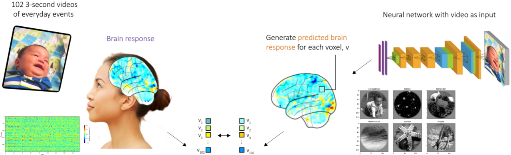

# Project Context
This project was conducted as a Group Exam Assignment for the Course Advanced Machine Learning at the IT University of Copenhagen in the Fall Semester 2023. The Project was graded 10 (B). The main branh contains the submitted exam material.

Equal Contributors are:
Frederik Bredgaard: [@Fred-Bred](https://github.com/Fred-Bred)
Aleksy Gałkowski: [@Alexiejow](https://github.com/Alexiejow)
Raghav Vacher: [@RaghavVacher](https://github.com/RaghavVacher)
Emily Krüger: [@emilykruger](/https://github.com/emilykruger)

# Project Description

## Modelling how the brain represents visual information

Data science and machine learning approaches have huge potential to boost fundamental research of understanding the brain. 
In this project, we model the visual processing hierarchy of the brain by building a deep CNN network with a bio-inspired architecture to represent intermediate feature extracting with fMRI data of brain imaging studies. In particular, we want to look at the human fMRI response to visual stimulation and investigate which brain regions encode which type of visual information by predicting fMRI response from the model. As input for the study and also our model, we consider 
- the [Kay & Gallant image + fMRI dataset](https://crcns.org/data-sets/vc/vim-1/about-vim-1) (via mp-brainvision-load-kay-images.ipynb) or 
- [The Algonauts video + fMRI dataset](https://docs.google.com/forms/d/e/1FAIpQLScqEf-F5rAa82mc1_qbnoMonHVmfFk52kaCJQpTAkDU0V5vUg/viewform) (via mp-brainvision-load-algonauts-videos.ipynb).

This task is based on [the Algonauts challenge](http://algonauts.csail.mit.edu/challenge.html) of modelling how the human brain makes sense of the world. Thus here, you can learn more basics on brain imaging and imaging data processing.

### Main goals:

- Do a comprehensive pre-processing and some visualisation of the fMRI data. Can you see patterns in the data for either input category?
- Train a voxel-wise encoding model (deep CNN network) to predict fMRI responses in different brain regions from the stimulus data as input. You might consider vanilla versus pre-trained image processing networks. Can you identify an architecture (and meta-parameter settings) that predicts well and remains bio-inspired regarding the hierarchy?
- Compare predictions of the individual layers (model) with activations of different regions (imaging data), e.g. through heatmaps. How does the cortex hierarchy compare to the model's hierarchy? Do you observe any patterns?

### Optional:

- Can you suggest which brain regions preserve spatial information? Apply image transformations randomly before feeding to the model and observe the change in encoding accuracy.
- Can you identify in which regions the brain might encode categorical information? For this, you might compare representation similarities (e.g. via RSA).
