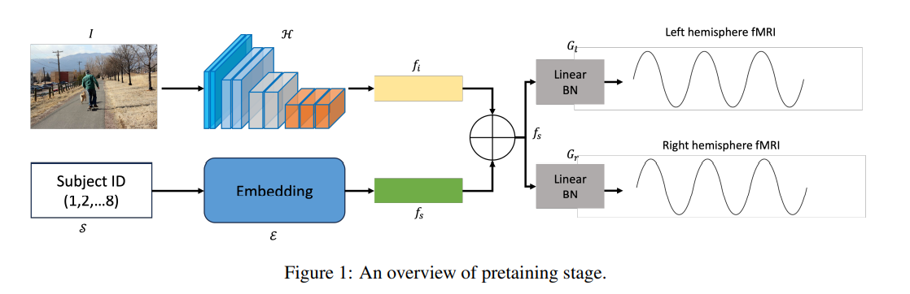

## Main Idea
- The approach involves constructing an image-based brain encoder through a two-step training process.
  - The first step involves creating a pretrained encoder using data from all subjects.
  - The second step fine-tunes individual subjects using various training strategies, including different loss functions and objectives.
  - The diverse training strategies are implemented to introduce variety into the models.
- The final solution consists of an ensemble of multiple unique encoders.

- Pretraining:
    - 