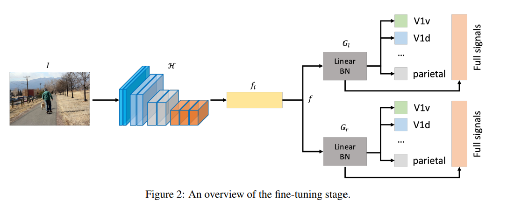
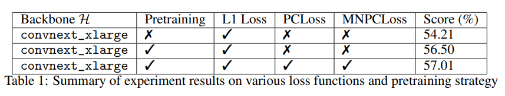

## Main Idea
- The approach involves constructing an image-based brain encoder through a two-step training process.
  - The first step involves creating a pretrained encoder using data from all subjects.
  - The second step fine-tunes individual subjects using various training strategies, including different loss functions and objectives.
  - The diverse training strategies are implemented to introduce variety into the models.
- The final solution consists of an ensemble of multiple unique encoders.

## Process
- Pretraining:
    - 
    - Let I ∈ R H×W×C be the input image where H, W, and C are the height, width, and number of channels. We use a deep neural network (DNN) denoted H to extract the features of this image denoted fi.
    - Then image and subject features are concatenated.
    - These features will be passed into two dependent blocks of linear and batch norm layers denoted as Gl and Gr.

- Fine-tuning:
    - 
    - used the pre-trained weight of DNN H and fine-tuned the individual data
    - add multiple heads, i.e., fully connected layers, to predict each signal of each region-of-interests
    - The final prediction is an average of each individual vertices and the full signals.

- Loss Functions:
    - Mean Normalized Pearson Correlation (MNNPC) Loss
    - Pearson Correlation Loss
    - Implementation in paper.

- Additional Information:
    - images are resized to 384 × 384
    - embedding vector dimension of the subject ds = 512
    - code is easily implemented in PyTorch framework
    - The learning rate is initially set to 0.0001 and then gradually reduced to zero under the ConsineLinear policy (LEARNING RATE SCHEDULER)
    - The batch size is set to 8/GPU.
    - model is optimized by AdamW for 12 epochs or until the network meets the early stopping.
    - The pertaining and fine-tuning are completed within 8 hours for each subject

- Results:
    - 

